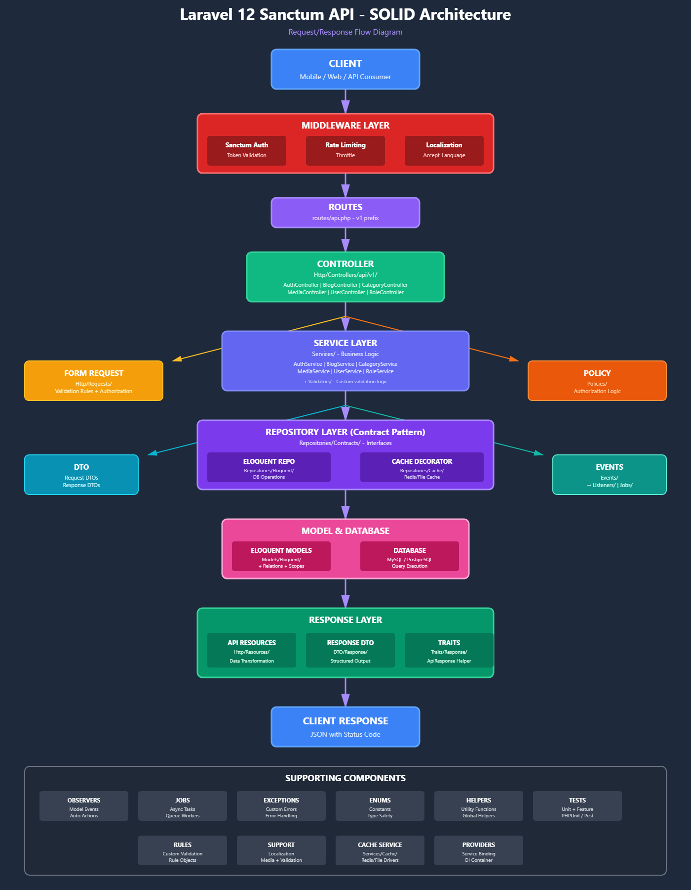

# Laravel API
_(turkish: Türkçe açıklamalar installation kısmından sonra)_

- A RESTful API built with SOLID, modern and clean architecture.

## Description 
- PHP 8.2+, Laravel 12.x<br><br>
- Laravel Sanctum (Authentication)<br><br>
- Interface-driven design with service + repository separation<br><br>
- Multi-language support<br><br>
- Translation support (any service can be integrated)<br><br>
- Role-based access control (RBAC)<br><br>
- Caching (Redis & File) — works with PHPRedis extension, <br><br>
multiple cache services can be used depending on the repository<br><br>
- MySQL (any database can be used — db-agnostic)<br><br>
- MediaHandler (images, videos, and audio can be processed; currently supports WebP conversion)

## What can you d🤨?
- This is a skeleton project with lots of room for improvements.
You can easily extend it and adapt it to your needs - fully open for your imagination. <br><br>
- My recommendations: optimize cache & SQL, refactor classes with too many responsibilities,
and consider building the frontend using the same services.<br><br>
- There are TODO notes inside the project for further improvements.<br><br>
- At the bottom, you will find an AI-generated diagram.  
It gives a quick overview of the system and helps you understand how to build on top of it.

## Installation

```bash
# Clone the repository
git clone https://github.com/emreziplar/Laravel-API.git

cd laravel-api
composer install
npm install

# Environment setup
cp .env.example .env
php artisan key:generate

# Database setup
php artisan migrate
php artisan storage:link

# Run the server
php artisan serve
```
💡 Tip: Using **Docker** is recommended for easier environment setup, including PHP, Redis and MySQL.
This makes the project more portable and production-ready.

## Türkçe olarak devam etmektedir.
# Laravel API

RESTful API projesi SOLID, modern ve temiz mimari ile geliştirilmiştir.

## Açıklama
- PHP 8.2+, Laravel 12.x<br><br>
- Laravel Sanctum (Kimlik doğrulama için)<br><br>
- Service + repository ayrımı ile interface tabanlı tasarım<br><br>
- Çoklu dil desteği<br><br>
- Çeviri desteği (istediğiniz servis eklenebilir)<br><br>
- Rol tabanlı yetkilendirme (RBAC)<br><br>
- Önbellekleme (Redis & File) — PHPRedis eklentisi ile çalışır, repository bazında birden fazla cache servisi kullanılabilir<br><br>
- MySQL (istediğiniz veritabanı kullanılabilir — db-agnostic)<br><br>
- MediaHandler (resim, video ve ses işlenebilir; şu anda WebP dönüşümü mevcut)<br><br>

## Neler Yapabilirsiniz?
- Bu proje bir iskelet yapıdır ve geliştirmeye açıktır.  
  İhtiyacınıza göre kolayca genişletebilir ve uyarlayabilirsiniz.<br><br>
- Öneriler: Cache ve SQL optimizasyonları, fazla sorumluluğu olan sınıfların refactor edilmesi ve frontend’i aynı servisleri kullanarak inşa etmek.<br><br>
- Proje içinde geliştirme için TODO notları bulunuyor.<br><br>
- En altta AI tarafından üretilmiş bir diyagram var.  
  Sistemi hızlıca anlamak ve üzerine geliştirme yapmak için inceleyebilirsiniz.

## Kurulum

```bash
# Depoyu klonla
git clone https://github.com/emreziplar/Laravel-API.git

cd laravel-api
composer install
npm install

# Ortam ayarları
cp .env.example .env
php artisan key:generate

# Veritabanı ayarları
php artisan migrate
php artisan storage:link

# Sunucuyu çalıştır
php artisan serve
```
💡 İpucu: **Docker** kullanmak tavsiye edilir. PHP, Redis ve MySQL ortamlarını kolayca hazırlar 
ve projeyi daha taşınabilir ve production-ready hâle getirir.

## 🤐 AI Diagram


